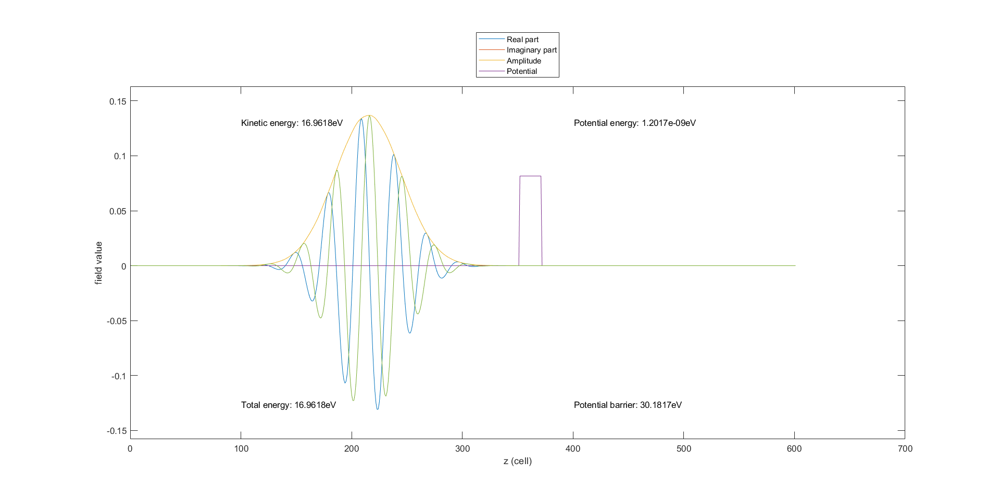
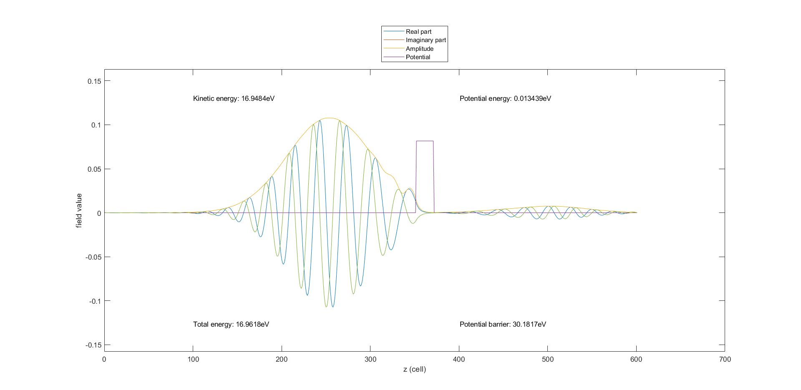

# Electron-quantum-tunnelling

W projekcie przeprowadzana jest jednowymiarowa symulacja propagacji funkcji falowej elektronu i napotkanie przez nią bariery potencjału. Symulacja oparta jest o równanie Schroedingera, gdzie pochodne są przybliżone różnicami skończonymi.

## Spis plików
-  main.cpp - przeprowadzenie symulacji i zapisanie wyników, co stałą liczbę kroków czasowych do plików binarnych
- plotpotential.m - narysowanie potencjału w przestrzeni
- plotwaveform.m - narysowanie danych z pliku binarnego
- wavemovie.m - utworzenie animacji funkcji falowej. Wyświetlana jest jej część rzeczywista, urojona, amplituda, a także potencjał w kolejnych chwilach czasu. Wyświetlana jest również energia kinetyczna, potencjalna i całkowita oraz wielkość bariery potencjału.

## Wyniki
Funkcja falowa elektronu przed spotkaniem z barierą potencjału: 

Funkcja falowa elektronu po zderzeniu z barierą potencjału: 

Warto zwrócić uwagę, że dla przyjętych, przykładowych danych energia kinetyczna elektronu jest mniejsza niż wielkość bariery potencjału. W przypadku klasycznym oznaczałoby to brak możliwości przedostania się przez nią tej cząstki. Jednak zgodnie z zasadami mechaniki kwantowej takie zdarzenie jest możliwe, co widać na drugim rysunku. Funkcja falowa przyjmuje niezerowe wartości za barierą potencjału, co oznacza, że w razie dokonania pomiaru i kolapsu funkcji falowej, elektron może znaleźć się właśnie tam (prawdopodobieństwo znalezienia cząstki w danym punkcie jest proporcjonalne do amplitudy jej funkcji falowej).  

